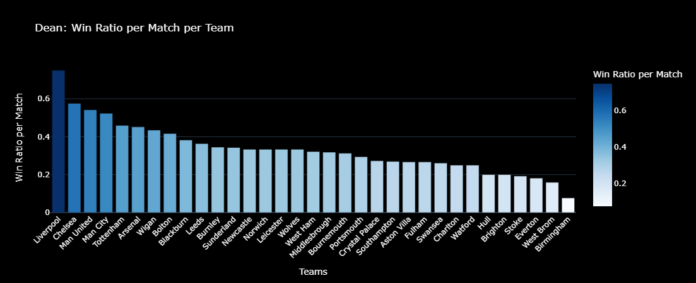
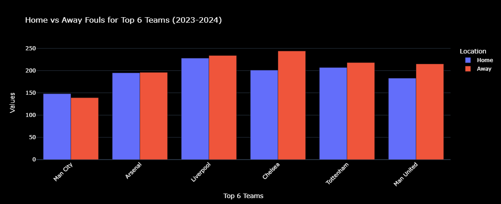

# Premier League Analysis

This project provides a comprehensive analysis of Premier League matches, focusing on the Top 6 teams and refereeing trends. Using various visualizations and statistical methods, we explore team performances, referee behaviors, and patterns across multiple seasons.
**For a better experience with interactive visualizations, feel free to explore the notebook.**
## Project Overview

This analysis includes:

1. **Cumulative Team Statistics Heatmap**: Displaying overall team stats (shots, corners, fouls) for the season.
2. **Top Referees' Card Distribution**: Comparing yellow and red cards given per match by the top 10 referees.
3. **Dean's Impact on Matches**: Analyzing card distribution and win rates when Mike Dean officiates matches, particularly for Top 6 teams.
4. **Win Rate Analysis Under Different Referees**: Studying how the win rate of Top 6 teams varies with different referees.
5. **Home vs Away Foul Counts**: Comparing the fouls committed by the Top 6 teams at home and away games.
6. **Season Performance Analysis**: "Stress Test" of Top 6 teams by analyzing their performance at the start and end of the season.

## Visualizations

### 1. Heatmap of Cumulative Team Statistics (2023-2024)
This heatmap shows cumulative team statistics, including shots, corners, and fouls, providing a quick overview of each team's playing style and intensity.

### 2. Heatmap of Cumulative Team Statistics
Another heatmap showing cumulative team statistics across multiple seasons, offering insights into team consistency and performance.

### 3. Top Referees by Yellow and Red Cards per Match
This bar chart displays the yellow and red cards per match for the top 10 referees. It highlights which referees tend to issue more cards, providing insights into their strictness in game officiating.

### 4. Yellow Cards Per Match for Each Team Under Mike Dean
This chart shows the average yellow cards given per match by referee Mike Dean for each team, providing insight into Dean’s strictness with each team.

### 5. Dean: Win Rate per Match for Each Team
This bar chart analyzes the win rate per match for each team when Mike Dean officiates, giving insights into how teams perform under Dean's officiating.

### 6. Win Rate of Top 6 Teams Under Different Referees
A heatmap illustrating the win rate of each Top 6 team under the top 10 referees, analyzing if certain referees favor or disadvantage particular teams.

### 7. Home vs Away Foul Counts for Top 6 Teams
This bar chart compares fouls committed by Top 6 teams during home and away games, showing whether playing location affects team aggressiveness.

### 8. Performance of Top 6 Teams in First and Last 5 Matches of the Season
This line chart analyzes whether Top 6 teams performed better at the beginning or end of the season. Points, goals scored, and goals conceded are tracked, offering insights into team resilience and form stability.

